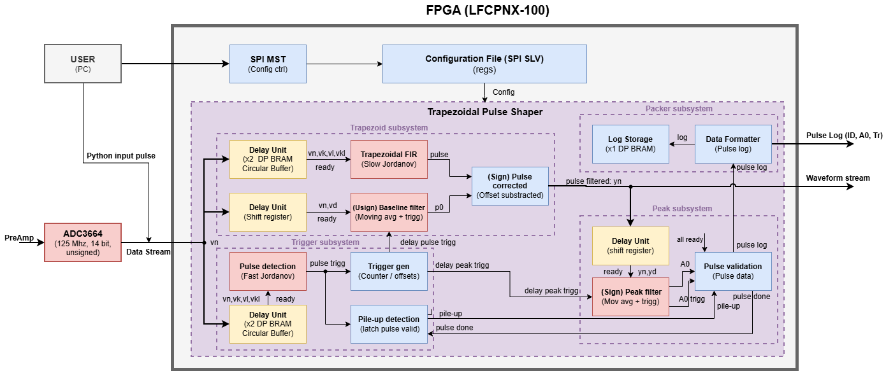

# Trapezoidal Pulse Shaping Filter

Project aimed at developing a trapezoidal filter with the Jordanov algorithm in real time for the calculation of energy from ionized particles.

Author: Aldo Lupio
