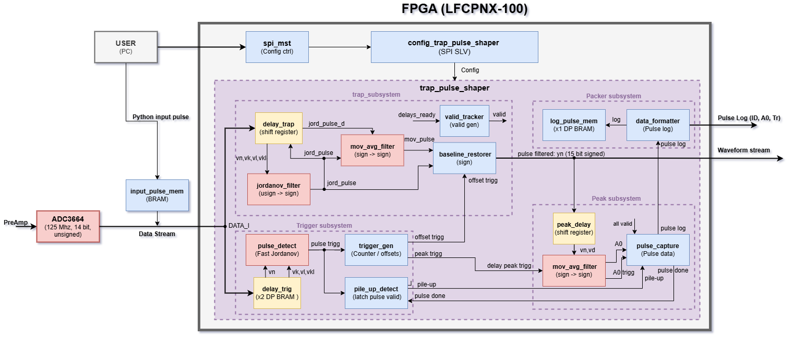

# Trapezoidal Pulse Shaping Filter
Real time trapezoidal pulse shaping filter based on the Jordanov recursive algorithm, for digital energy measurement of ionizing radiation. 
Implemented in VHDL for Lattice Radiant FPGAs.

## Overview

System block diagram:

---

Author: Aldo Lupio
