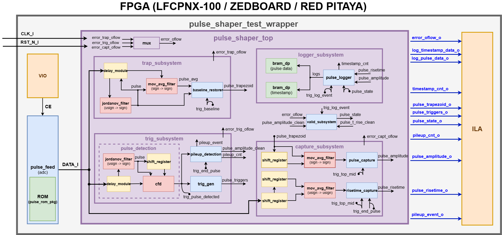

# Trapezoidal Pulse Shaping Filter

Real time trapezoidal pulse shaping filter based on the Jordanov recursive algorithm, for digital energy measurement of ionizing radiation.

Written in plain VHDL. Validated on AMD ZedBoard, Red Pitaya 125-14 and Lattice CertusPro-NX.

---

## Overview

For every pulse arriving from a charge sensitive preamplifier, the core produces a trapezoidal shaped signal, measures its **amplitude** and measures the **rise time** (10% to 90%) of the original pulse. Together they allow the user to identify the particle that produced the pulse.

The core detects pulses on its own, tracks and subtracts the baseline, flags pileup events, and logs every event with a timestamp into a dual port BRAM that the user reads through port B. Tested for more than 2 hours continuously with real ADC stream data.



**Key characteristics**

| | |
|---|---|
| Throughput | One sample per clock, single clock domain |
| Rise time `k` | 16 to 256 samples (0.13 – 2.05 µs at 125 MHz) |
| Flat top `m` | 16 to 256 samples (0.13 – 2.05 µs at 125 MHz) |
| Decay correction | Up to 4096 samples (32.8 µs at 125 MHz) |
| Event log | 1024 events by default, readable while acquiring |
| Max frequency | 128.7 MHz on Zynq-7020 |

---

## Quick start

Everything is built by TCL scripts in `scripts/`.

### Run the test wrapper on a ZedBoard

Creates a complete project with the RTL, a virtual pulse generator and the test wrapper, ready to simulate and program.

```bash
vivado -mode batch -source scripts/build_zedboard_trap_filter.tcl
```

### Package the IP for your own design

```bash
vivado -mode batch -source scripts/generate_pulse_shaper_ip.tcl
```

This writes `ip/trap_filter/component.xml`. To use it in an existing project:

```tcl
set_property ip_repo_paths <path>/trap_filter/ip [current_project]
update_ip_catalog -rebuild
```

The core then appears under **IP Catalog → User Repository → UserIP**.

> If a Vivado project is already open, `source` the same script from its TCL console instead to package it in the same project.

### Run on a Red Pitaya with live ADC data

```bash
vivado -mode batch -source scripts/build_redpitaya_trap_filter.tcl
```

 It needs the IP to be already generated. Creates the project, builds the block design and adds the top wrapper.

### Lattice Radiant

Radiant has no equivalent IP packaging flow, so the core is used as RTL:

```tcl
source <path>/trap_filter/scripts/build_lattice_trap_filter.tcl
```

> Implementation reports need the number of I/O ports reduced, use a dummy wrapper.

### Simulate in ModelSim

```tcl
cd <path>/trap_filter/sim/modelsim
do compile_pulse_shaper_top.do
do simulate_pulse_shaper_top.do
run -all
```

---

## Configuration

Five parameters need to match your detector. Everything else can keep its default.

| Generic | Default | Set it from |
|---|---|---|
| `G_SLOW_JORD_M_EXP_VALUE` | 39992 | Decay time constant τ of preamplifier tail |
| `G_NOISE_THRESHOLD` | 100 | Noise deviation measured in ADC LSB |
| `G_SLOW_JORD_M_DELAY` | 256 | Charge collection time |
| `G_SLOW_JORD_K_DELAY` | 128 | Pulse rise time |
| `G_PILEUP_DECAY_VALUE` | 2500 | Window where a new pulse is pileup |

All parameters are fixed at synthesis.

---

## Repository layout

```
board/      board files
build/      Generated folder of projects
constraints/xdc files
docs/       User guide and diagrams
ip/         Packaged IPs
scripts/    Build and packaging TCL scripts
sim/        ModelSim compile and run scripts
src/        RTL, package and integration wrappers
sw/         Python scripts (pulse stimulus)
```

---

## Things to watch out for

- **The ADC clock and the system clock must be the same**, or synchronous.
- **The input data is unsigned**.
- **There is no data valid input.** Every value on `DATA_I` is treated as a new sample.
- **The first baseline rise after reset may be logged as an event.** Release reset when ADC is already streaming or discard the first event.
- **Pulse detection presents limitations** on very small and slow pulses.
- **The logger stops when full.** Assert `LOG_CLEAR_I` to reset the log pointer.
- **Overflow flags are sticky** until new reset assertion.

---

## Documentation

The full user guide covers the interface, the encoded output vectors, the internal architecture and validation of the results.

📄 [`docs/trapezoidal_pulse_shaper_ip_user_guide.pdf`](docs/trapezoidal_pulse_shaper_ip_user_guide.pdf)

---

## Reference

V. T. Jordanov and G. F. Knoll, *Digital synthesis of pulse shapes in real time for high resolution radiation spectroscopy*, NIM A 345 (1994).

Red Pitaya board files and ADC IP from [fabzz60/demo_adc_dac_Redpitaya_125_14](https://github.com/fabzz60/demo_adc_dac_Redpitaya_125_14).

---

Author: Aldo Lupio — [IRAP](https://www.irap.omp.eu/)